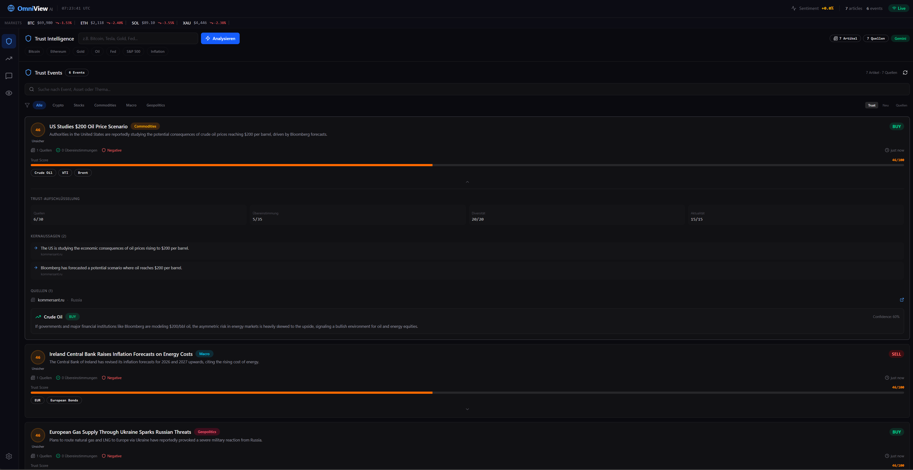

# OmniView AI

Global news analysis engine that breaks through filter bubbles. Aggregates real-time news from 40+ countries via GDELT, uses AI to detect narrative clusters, reporter bias, and investment signals.

Supports multiple AI providers: **Claude**, **ChatGPT**, and **Gemini**.

## Features

- **Live News Feed** -- Real-time articles from GDELT (free, no API key), clickable links to original sources
- **Narrative Clustering** -- AI groups articles by semantic similarity across countries
- **Reporter Bias Tracking** -- Neutrality scoring (0-100) based on language, framing, and sourcing
- **Investment Signals** -- BUY / SELL / WATCH recommendations with confidence levels
- **AI Chat** -- Attach articles, compare cross-country coverage, get neutrality analysis
- **Watchlist** -- Monitor topics for ongoing signal tracking
- **Multi-Provider** -- Switch between Claude, ChatGPT, and Gemini in Settings
---
 <p align="center">
  
</p> 


## Setup

```bash
npm install

cp .env.example .env.local
# Add at least one AI provider API key

npm run dev
```

Open [http://localhost:3000](http://localhost:3000).

## AI Providers

Add one or more API keys to `.env.local`:

| Provider | Key | Get it at |
|----------|-----|-----------|
| Claude (Anthropic) | `ANTHROPIC_API_KEY` | [console.anthropic.com](https://console.anthropic.com/) |
| ChatGPT (OpenAI) | `OPENAI_API_KEY` | [platform.openai.com](https://platform.openai.com/api-keys) |
| Gemini (Google) | `GEMINI_API_KEY` | [aistudio.google.com](https://aistudio.google.com/apikey) |

The app auto-detects configured providers. Switch between them in the Settings tab. News data comes from GDELT (free, no key required).

## Tech Stack

- Next.js 16 + React 19
- Tailwind CSS 4 + shadcn/ui
- Recharts
- `@anthropic-ai/sdk`, `openai`, `@google/genai`
- GDELT API

## Architecture

```
src/
├── app/
│   ├── api/
│   │   ├── analyze/     # AI narrative + bias + signal analysis
│   │   ├── chat/        # Conversational AI with article context
│   │   ├── news/        # GDELT news aggregation
│   │   ├── providers/   # Available AI provider info
│   │   └── signals/     # Real-time signal generation
│   └── page.tsx         # Main dashboard
├── components/
│   ├── chat/            # AI chat with article attachment
│   ├── watchlist/       # Topic monitoring
│   ├── settings/        # Provider selection UI
│   ├── dashboard/       # News feed, clusters, article cards
│   ├── signals/         # Investment signal display
│   ├── bias/            # Reporter bias tracking + charts
│   └── layout/          # Sidebar, header
├── hooks/               # Data fetching hooks
└── lib/
    ├── ai-providers.ts  # Multi-provider abstraction (Claude/GPT/Gemini)
    ├── anthropic.ts     # Analysis logic + JSON parsing
    ├── gdelt.ts         # GDELT news fetcher
    ├── types.ts         # TypeScript interfaces
    └── countries.ts     # 44 country definitions
```
